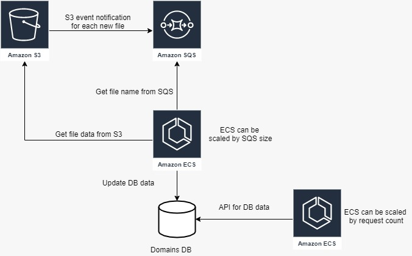

# elementor task

## How to install:
requirements:
*   python3
*   requests - pip install requests or pip install -r requirements.txt

# How to run:
python api.py <csv file>

# sql answers in sql_questions.txt

# aws arch: 

# To improve:
didn't have time to write this

